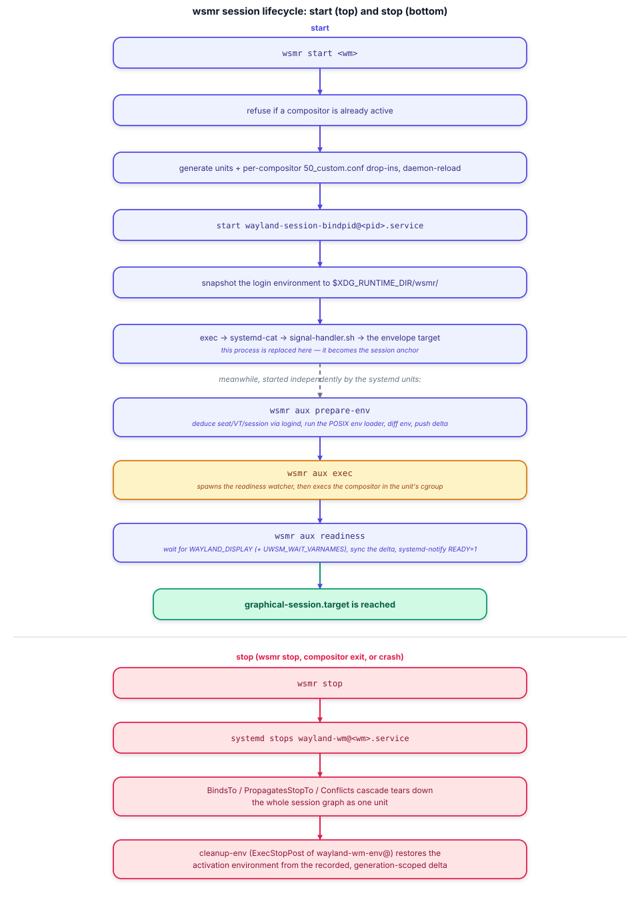
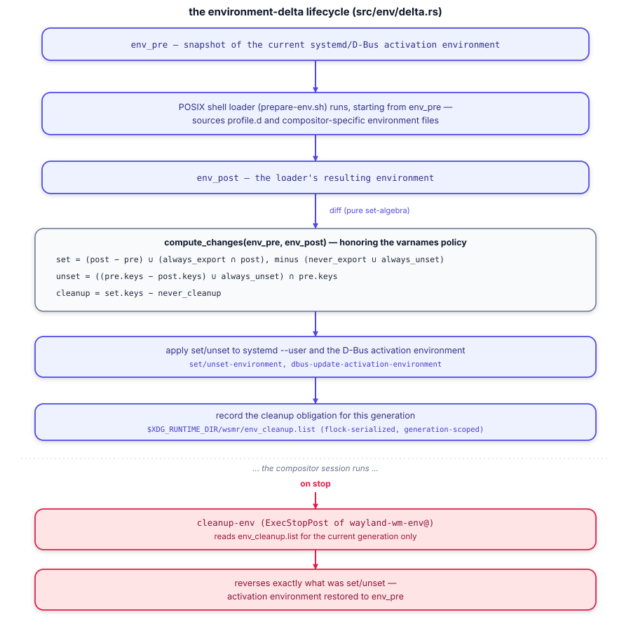

# Architecture

How wsmr actually works, end to end: the unit graph it generates, the
process lifecycle from `start` to `stop`, and the environment-delta
machinery that is the hard part of the whole exercise. This is the deep
dive; the [top-level README](../README.md) has the short version.

For what's actually been verified on real hardware (as opposed to what the
design says should happen), see [`docs/known-issues.md`](known-issues.md)
and [`docs/fix-plan.md`](fix-plan.md).

## Design philosophy

wsmr does not manage your session itself. It generates a graph of
**systemd user units**, hands the compositor's lifecycle to `systemd --user`,
and gets out of the way. Concretely, that means:

- **Plan, then apply.** Every mutating operation (`start`, `stop`) first
  computes what it *would* do — which units would be written, changed, or
  conflict with something already there — entirely from read-only checks,
  before touching disk or the systemd user manager. `start --dry-run` is a
  strict superset of what a real run would report, never less informative,
  because it runs the exact same planning code path.
- **Ownership is tracked, not assumed.** wsmr fingerprints every unit file it
  writes (see `src/units/manifest.rs`) so it can tell its own generated
  files apart from a foreign file that happens to share a name (e.g. a
  hand-written drop-in, or one written by a coexisting uwsm install). It
  refuses to overwrite or delete anything it doesn't recognize as its own.
- **Side effects are isolated behind small traits/wrappers** (`src/sysd/dbus.rs`
  wraps `zbus`; process spawns go through `std::process::Command`) so the
  logic layered on top — unit rendering, the env-delta set-algebra, CLI
  parsing — is unit-testable without a live systemd/D-Bus session. That's
  what makes it possible to develop this on a Mac (see the top-level
  `CLAUDE.md`) and still have meaningful test coverage.

## Module layout

| Path | Responsibility |
|---|---|
| `src/cli.rs` | The `clap`-derived CLI surface — mirrors uwsm's argparse tree. |
| `src/session/` | The verb implementations: `start`, `stop`, `finalize`, `exec`, `prepare`, `check`, `cleanup`, `wait`, and `state` (the shared generation/lock machinery all of them go through). |
| `src/units/` | The static unit graph (`templates.rs`), the plan/apply/diff engine (`plan.rs`, `generate.rs`), and the ownership manifest (`manifest.rs`). |
| `src/env/` | The environment-delta set-algebra (`delta.rs`) and the on-disk snapshot format (`files.rs`, `dump.rs`). Pure logic, no I/O side effects beyond reading/writing plain files. |
| `src/app/` | `app` subcommand support: desktop-entry parsing (`entry.rs`), `Exec=` field-code expansion (`field.rs`), resolution (`find.rs`), terminal wrapping (`terminal.rs`), unit naming (`naming.rs`), launching (`launch.rs`), and the optional fast-path daemon (`daemon.rs`). |
| `src/sysd/` | The D-Bus/systemd boundary — blocking `zbus`, talking to systemd's own D-Bus API directly (no `libsystemd` FFI). |
| `src/comp.rs`, `src/varnames.rs`, `src/filter.rs` | Compositor identity resolution, and the variable-classification policy (`always_export`/`never_export`/`always_unset`/`never_cleanup`) that `env/delta.rs` applies. |
| `src/util/` | XDG path resolution and small filesystem helpers, kept minimal and hand-rolled rather than pulled in from `xdg`/`freedesktop-desktop-entry` (see the top-level `CLAUDE.md`'s "Crate choices"). |

## The unit graph

`start` renders a full graph of systemd **user** units into the unit rung
(`$XDG_RUNTIME_DIR/systemd/user` by default, `$XDG_CONFIG_HOME/systemd/user`
with `-U home`), diff-on-write so a re-run with nothing changed is a no-op.
Unlike upstream uwsm — which ships most of these units statically via its
build and only generates small per-compositor drop-ins at runtime — wsmr
generates the **whole graph** at runtime from `src/units/templates.rs`. That
keeps it a self-contained binary with no separate data files to install, and
means the units can never drift from the binary that wrote them. The static
bodies are kept **byte-identical** to upstream's own shipped units —
`tests/uwsm_unit_compat.rs` diffs them against a real uwsm 0.26.7 install to
enforce that claim, not just assert it in a comment.


The `BindsTo=`/`PropagatesStopTo=`/`Conflicts=`/`OnSuccess=`/`OnFailure=`
wiring is what makes the whole graph behave as a single unit: starting the
compositor pulls in everything above it in the diagram, and the compositor
exiting (cleanly or not) triggers `wayland-session-shutdown.target`, which
`Conflicts=` every session-scoped unit and tears the rest down without wsmr
having to orchestrate each stop by hand.

Two things worth calling out that the diagram simplifies:

- `wayland-wm@.service` also carries `After=wayland-session-pre@%i.target`
  (pure ordering, not a hard dependency — it's already `Requires=`d, so this
  just fixes the sequencing).
- Per-compositor customization (a non-default `-D` desktop-name list, an
  absolute/hardcoded compositor path, a display name or description) is
  injected as `50_custom.conf`-style drop-ins on top of the static
  `wayland-wm-env@`/`wayland-wm@` services, generated by
  `src/units/templates.rs::{preloader_dropin, service_dropin}` — the static
  graph itself never changes per compositor, only these drop-ins do.

## Session lifecycle



`start`'s own process becomes the **session anchor**: after the read-only
eligibility checks (not already active; the generation plan has no
conflicts) and generating/reloading units, it snapshots the login
environment, duplicates its own stdout/stderr onto fds 3/4 (so a later
shell script can talk past `systemd-cat`, which otherwise swallows fd 1/2
into the journal), and **exec's itself away** into
`systemd-cat -- /bin/sh signal-handler.sh <envelope-target>`. From that point
the original `wsmr start` process no longer exists — the shell script is
what waits out the session and handles VT hand-off signals (see
[Known issues](known-issues.md) for the one case, kmscon, where that
hand-off matters and still isn't enough on its own).

Everything else in the diagram runs as **separate processes**, started by
the units themselves, not as function calls within `start`:

- **`wsmr aux prepare-env`** (the `wayland-wm-env@` service) deduces
  seat/VT/session identity via logind, runs the POSIX shell loader
  (`prepare-env.sh` — sources `/etc/profile`-style files and any
  compositor-specific environment scripts), and computes+pushes the
  environment delta. See [The environment delta](#the-environment-delta)
  below.
- **`wsmr aux exec`** (the `wayland-wm@` service) spawns the readiness
  watcher as an independent child, then execs the compositor into that
  service's cgroup.
- **`wsmr aux readiness`** waits for `WAYLAND_DISPLAY` (plus any
  `$UWSM_WAIT_VARNAMES`) to show up in the activation environment, syncs the
  delta one more time, then execs `systemd-notify --ready` — satisfying the
  service's `Type=notify`.

That readiness watcher is **spawned, not forked**, which is a deliberate
divergence from upstream (which double-forks it): `zbus`'s async-io reactor
thread does not survive `fork()`, so a forked watcher's D-Bus connection is
dead on arrival and would never signal readiness. This was found via the
Tier-B integration test running on real systemd — the kind of bug that
can't show up in a pure unit test. A compositor can also just call
`wsmr finalize` directly from its own autostart (`exec-once=` in Hyprland's
case) to export variables and signal readiness itself; either path
satisfies the same `Type=notify` contract.

**Stop** is comparatively simple by design: `wsmr stop` (or the compositor
exiting/crashing on its own) stops `wayland-wm@`, and the
`BindsTo`/`PropagatesStopTo`/`Conflicts` wiring from the unit graph cascades
the rest of the teardown without any further orchestration. The one thing
wsmr *does* still have to do by hand is restore the environment —
`cleanup-env`, running as `wayland-wm-env@`'s `ExecStopPost`, reverses
exactly the delta it recorded at start. See
[Known issues](known-issues.md#hyprland-leaves-five-environment-variables-behind-on-its-own)
for a real gap here — not in wsmr's own bookkeeping, but in a real
compositor's own environment-export habits, which wsmr has no way to
intercept.

## The environment delta

This is the part upstream uwsm and wsmr both spend the most code on, because
it's genuinely the hard problem: a Wayland compositor started under a
session manager needs `systemd --user` and D-Bus-activated services to see
`WAYLAND_DISPLAY` and friends, but only the *right* variables, only while
the session is up, and cleanly reversed afterwards — without clobbering
anything the user's shell profile legitimately set that has nothing to do
with the session.



`src/env/delta.rs::compute_changes` is pure set-algebra over two snapshots
(`env_pre`, taken before the POSIX loader runs; `env_post`, taken after),
filtered through the variable-classification policy in `src/varnames.rs`
(`always_export`, `never_export`, `always_unset`, `never_cleanup` — ported
directly from upstream's own classification, not invented independently).
It has no side effects and is the most thoroughly unit-tested part of the
crate for exactly that reason: it's the one place where getting a boundary
case wrong (a variable that should have been cleaned up but wasn't, or vice
versa) silently corrupts every session after the first.

**Generations.** Every `start` mints a fresh random generation id
(`src/session/state.rs::begin_generation`). Every cleanup-list entry is
tagged with the generation that requested it, so `cleanup-env` only ever
acts on entries belonging to the generation currently on record — a stale
entry from a different, earlier session can't be mistaken for this one's.
The state files (`env_pre`, `env_cleanup.list`, `generation`, all under
`$XDG_RUNTIME_DIR/wsmr/`) are serialized through a single OS-level advisory
lock (`flock(2)` via `std::fs::File::lock`), which gives clean crash
semantics for free — a process that dies while holding the lock has it
released by the kernel when the fd closes, no stale-lockfile cleanup needed.

A fresh generation always starts by resolving any abandoned prior state
first, which closes the common failure mode (a crash that skipped
`cleanup-env` entirely). The one gap that isn't closed: if an old session's
`cleanup-env` is *still running* at the exact moment a new `prepare-env`
starts, the late cleanup has no way to carry its own generation id forward
across the process boundary (unit templates are static), so it acts on
whatever generation is current by the time it acquires the lock. This is a
narrow window — `start` already refuses to begin while any compositor unit
is active/activating — and is documented in code at
`src/session/state.rs` rather than silently left as a surprise.

## Launching apps

```sh
wsmr app firefox.desktop                 # resolve a desktop entry, expand its Exec
wsmr app -- mpv ~/clip.mkv               # or a bare command
wsmr app -t service -- syncthing         # managed .service instead of a .scope
wsmr app -s b -- some-daemon             # background-graphical.slice
wsmr app -T -- btop                      # run inside the configured terminal
```

`app` resolves the target (a desktop-entry id/path, or a bare command),
expands `Exec=` field codes (`%f %F %u %U %c %k %i`, including
multi-instance fan-out for entries that request it), optionally wraps the
result in the user's configured terminal (`xdg-terminals.list`, or a
`TerminalEmulator`-category scan as a fallback), then hands it to
`systemd-run --user` as either a transient `.scope` (default — dies with
the launching process) or a managed `.service`, landing in the appropriate
slice (`app-graphical.slice`, `background-graphical.slice`, or
`session-graphical.slice` — see the "independent / auxiliary units" row in
the unit-graph diagram above). `wayland-wm-app-daemon.service` is an
optional FIFO-based fast path so a thin client can request a launch without
paying a full Rust process startup on every single invocation.

## CLI surface

| Command | Purpose |
|---|---|
| `start` | Generate the unit graph and bootstrap a compositor session. |
| `stop` | Stop the running session (optionally removing generated units). |
| `finalize` | Export variables into the activation environment and signal readiness — run by the compositor itself. |
| `app` | Launch an application as a scope/service unit under the session. |
| `check is-active` / `check may-start` | Session-state predicates, for use in login scripts. |
| `aux {prepare-env,cleanup-env,exec,readiness,waitpid,waitenv,app-daemon}` | Internal helpers, invoked only by the generated units — not meant to be run by hand. |

`select` (upstream's desktop-entry chooser) is intentionally not ported —
compositor selection is out of scope for wsmr; your display manager or login
script picks the session, and wsmr just does the systemd plumbing for the
command it's handed.

## Compositor support

**Only Hyprland has been run through this design for real.** Everything
above describes what wsmr generates and how it's supposed to behave, and
that behavior is exercised end-to-end against a *stub* compositor on real
systemd (`just integration`) plus, once, a real Hyprland session on real
hardware (see [`docs/fix-plan.md`](fix-plan.md)'s Phase 7). The unit graph
and env-delta logic are compositor-agnostic by design — the same as
upstream uwsm's — but wsmr itself has never been run against sway, niri,
river, labwc, or anything else. See
[`docs/known-issues.md`](known-issues.md#compositor-support-here-be-dragons)
for exactly what that does and doesn't imply.
