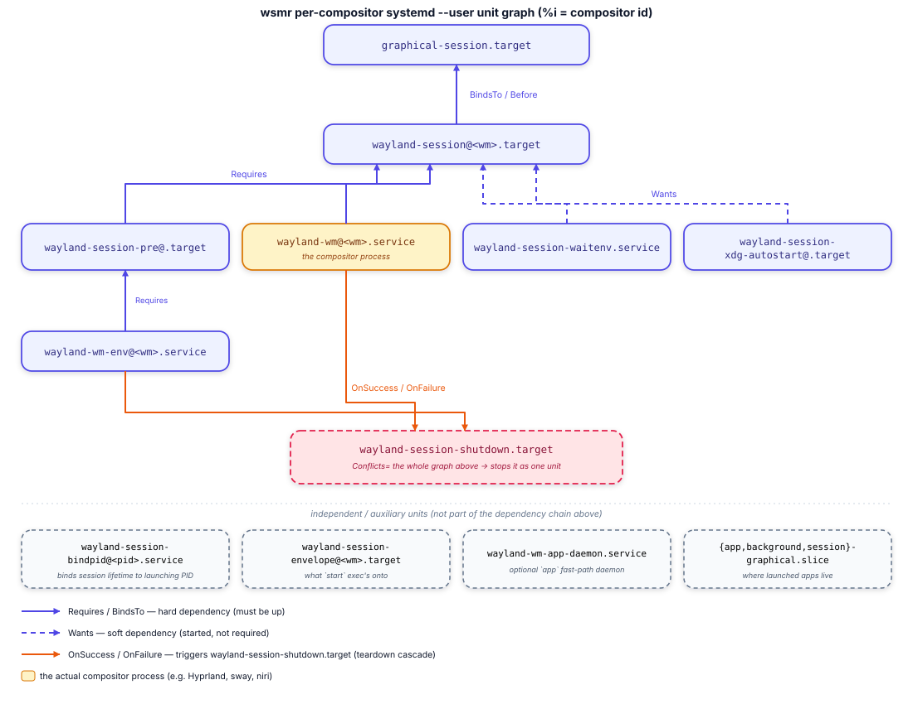

# Unit graph

`start` renders the systemd user units defined in `src/units/templates.rs`.
The default destination is `$XDG_RUNTIME_DIR/systemd/user`.

## Main units

| Unit | Responsibility |
|---|---|
| `wayland-session-envelope@.target` | Contains the session and binds its lifetime to the start process. |
| `wayland-session-pre@.target` | Orders environment preparation before the graphical session. |
| `wayland-wm-env@.service` | Runs `aux prepare-env`; runs `aux cleanup-env` after stop. |
| `wayland-wm@.service` | Runs the compositor through `aux exec` and waits for readiness notification. |
| `wayland-session@.target` | Connects the compositor to `graphical-session.target`. |
| `wayland-session-xdg-autostart@.target` | Connects the session to `xdg-desktop-autostart.target`. |
| `wayland-session-shutdown.target` | Conflicts with session units to coordinate teardown. |
| `wayland-session-bindpid@.service` | Ends the session when the original session-anchor PID exits. |
| `wayland-session-waitenv.service` | Waits for `WAYLAND_DISPLAY` and configured variables. |

The graph also defines three graphical slices and an optional application
argument daemon. Those units are independent of a specific compositor
instance but are tied to `graphical-session.target`.

## Startup and shutdown propagation

`Requires=`, `BindsTo=`, and ordering dependencies pull in preparation before
the compositor and graphical targets.

The compositor service has both `OnSuccess=` and `OnFailure=` pointing to the
shutdown target. A clean exit and a crash therefore enter the same teardown
path. `Conflicts=` and `PropagatesStopTo=` then stop the session-scoped graph.

This is why `wsmr stop` does not need to stop every unit individually.

## Per-compositor drop-ins

The static graph is the same for every compositor. wsmr writes
`50_custom.conf` drop-ins when a session needs values such as:

- an explicit desktop-name list;
- a display name or description; or
- a hardcoded compositor command.

The relevant renderers are `preloader_dropin` and `service_dropin` in
`src/units/templates.rs`.

## Compatibility check

`tests/uwsm_unit_compat.rs` compares the static graph against units taken from
an actual uwsm 0.26.7 installation. Per-compositor drop-ins are wsmr-generated
and are not part of that byte-for-byte comparison.
