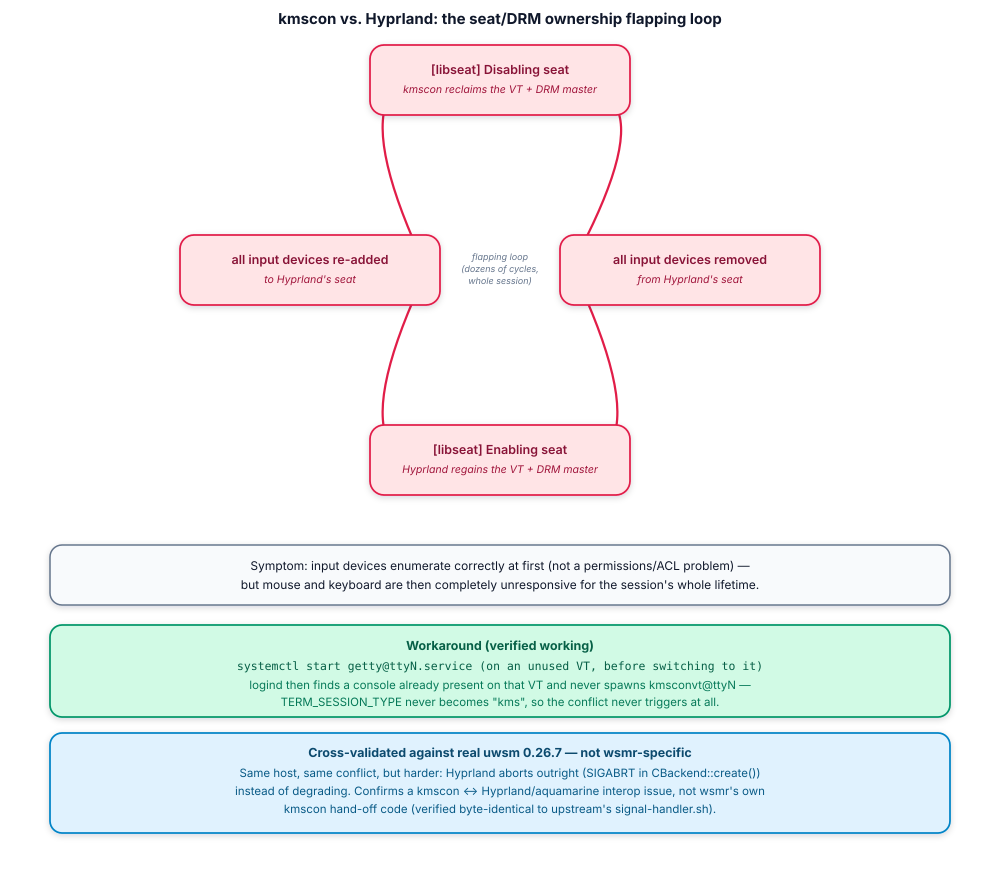

# Known issues & environment quirks

Everything in this document was found running a **real** wsmr-managed
Hyprland session on real hardware — not inferred from source reading. Each
finding was then **cross-validated against real upstream `uwsm` 0.26.7** on
the exact same machine/account/compositor, specifically to answer "is this a
wsmr bug, or something wsmr just happens to expose?" Where that's noted
below, it's because it was actually run, not assumed.

This document is the standalone, distilled record — the journal excerpts
and exact commands quoted below are the evidence, kept inline rather than
split across files.

## Compositor support: here be dragons

**wsmr has only ever been run against Hyprland.** The unit graph and
environment-delta logic in [`docs/architecture.md`](architecture.md) are
compositor-agnostic by design — the same design upstream uwsm uses across
sway, niri, river, labwc, and everything else it supports — but that's a
design claim, not a tested one, for anything other than Hyprland here.

| Compositor | Status |
|---|---|
| **Hyprland** | The only one actually run. Version `0.56.2-1` on this host. Real session, real monitors, real display-manager-mediated login (both a disposable test account and, since 2026-08-30, the primary account's own daily-driver desktop) — see the findings below. |
| niri, sway, river, labwc, anything else | **Untested. Here be dragons.** No reason to expect the core session/env machinery to behave differently — it doesn't touch compositor internals — but the findings on this page (especially the kmscon conflict, which is a VT/seat-ownership issue between *any* compositor and kmscon) have only been confirmed for Hyprland's specific DRM/seat handling and its specific `exec-once=`/environment-export behavior. Don't assume any of the specifics below transfer; do assume the *category* of problem (seat ownership on manual VT switches, environment re-export races, portal robustness during teardown) is worth checking for on any compositor. |

If you run wsmr against something other than Hyprland and it works (or
doesn't), that's genuinely new information — add a section to this file.

## kmscon fights the compositor for seat/DRM ownership

**Real, reproducible. Confirmed present under both wsmr and real uwsm — not
a wsmr defect.**

On systems where `systemd-logind`'s `autovt@.service` is aliased to
`kmsconvt@.service` (check with `systemctl cat autovt@.service`) — which is
the default on this CachyOS host — switching to *any* unused VT spawns
`kmscon` (a KMS-based styled text console) instead of a bare `getty`. wsmr's
own hand-off code (`libexec/signal-handler.sh`, ported verbatim from
upstream) correctly detects `TERM_SESSION_TYPE=kms` in that case and sends
kmscon the proper `\033]setBackground\a` escape-sequence hand-off via the
fd-3/fd-4 messaging path `src/session/start.rs` sets up before re-exec'ing —
this was inspected and is structurally correct.

Despite that, starting a session from a login shell hosted inside
`kmscon --vt=tty2 --no-switchvt` produced a session with **completely
non-functional mouse and keyboard input**. Pulling the real
`hyprland.log` (Hyprland disables stdout logging right after startup, so
this requires reading the file directly) showed a repeating cycle for the
entire life of the session:



Initial device enumeration was correct (real mouse/keyboard detected and
named properly), which rules out a plain permissions/ACL problem — this is
a live ownership conflict between two processes that both think they should
own the seat, not silent denial.

**Workaround (verified working):** explicitly run
`systemctl start getty@ttyN.service` on an unused VT *before* switching to
it. That makes `logind` see a console already present on that VT, so it
never spawns `kmsconvt@ttyN` there — `TERM_SESSION_TYPE` is then never
`kms`, wsmr's kmscon hand-off code never has to run, and the flapping never
starts at all (`grep -c "Enabling seat"` on such a session's log: `0`, vs.
dozens on the first attempt).

**Cross-validated against real uwsm 0.26.7 — confirmed, not just
predicted.** Structurally first: uwsm's actual Python
(`main.py:4863-4884`) uses the identical `os.dup2(1, 3)`/`os.dup2(2, 4)` +
`systemd-cat`-wrapped `signal-handler.sh` invocation wsmr's Rust port uses,
and `diff /usr/lib/uwsm/signal-handler.sh libexec/signal-handler.sh` is
empty except for an added attribution comment. Then live: running the same
account/compositor/config through real uwsm on a kmscon-hosted VT crashed
Hyprland outright at startup —
`terminate called after throwing an instance of 'std::runtime_error'`,
`what(): CBackend::create() failed!`, a genuine SIGABRT with a
`systemd-coredump` core dump. `CBackend::create()` is Hyprland's DRM/KMS
backend initializer, consistent with kmscon still holding those resources
when Hyprland tried to grab them — the same underlying conflict as the wsmr
run, just a *harder* failure (an outright crash instead of a
degraded-but-running session), which is itself consistent with this being a
genuine timing race rather than a deterministic bug. **This settles it: uwsm
has the identical kmscon problem wsmr does.** Root cause is on kmscon's
side, or in the kmscon↔Hyprland/aquamarine hand-off specifically — not in
either session manager's own signal-handling code.

**Tracked upstream, not resolved.**
[hyprwm/Hyprland#7423](https://github.com/hyprwm/Hyprland/issues/7423)
("Crash when launched in kmscon console", filed August 2024) reports the
same category of symptom independently — including from another CachyOS
user on the same `autovt@` → `kmsconvt@` default — and was closed
**not planned** rather than fixed. The thread is genuinely mixed: one
reporter's crash was separately attributed to a missing GPU driver, but
others in the same thread describe the actual kmscon/Hyprland conflict and
independently landed on mitigations that match this document's own
findings (running `seatd`, or simply not letting kmscon claim the target
VT). Nobody has root-caused it to a specific commit on either project's
side; it's a known, recurring interop gap, not something either side has
formally owned.

### Why doesn't a real display-manager login hit this?

This host's actual greeter is `greetd` running `noctalia-greeter-session` —
`sddm.service` doesn't even exist on this system. The likely reason a
normal greeter-mediated login never sees the kmscon conflict: `greetd`
owns VT1 directly via its own service configuration (`vt: Specific(1)`),
rather than switching to an unused VT and letting `logind` decide what to
spawn there on demand. The generic
`autovt@`→`kmsconvt@` aliasing only fires for a VT that's being switched to
and doesn't already have a claimed console — which never happens to VT1
under `greetd`'s own config. **This is a reasoned inference from confirmed
facts, not something independently live-tested yet** — worth doing before
treating it as settled.

## Hyprland itself can SIGSEGV during ordinary logout cleanup

**Observed once, real, distinct from the portal SIGSEGV below — not deeply
root-caused, not cross-validated against real `uwsm`.** On the same host,
before any of this document's other findings were investigated, a normal
logout from a real Hyprland session crashed with a `systemd-coredump`
report for the `Hyprland` binary itself (not a helper process). The stack
trace runs through `CCompositor::cleanup()` →
`CHyprDropShadowDecoration::updateWindow` → `CWindow::updateWindowDecos` →
`Layout::CWindowGroupTarget::onUpdateSpace`/`assignToSpace` → `CGroup`/
`CWindow` destructors — a crash in Hyprland's own window-group/decoration
teardown code path while `CCompositor::cleanup()` is tearing down its
window state during shutdown.

This is **not** the `xdg-desktop-portal-hyprland` crash documented below —
different binary, different stack, different trigger (that one fires from a
Wayland registry event landing during teardown; this one is purely
Hyprland's own internal window/group cleanup, no portal involved). Session
manager involvement (wsmr or `uwsm`) is incidental here: `wsmr`/`uwsm` only
ever ask systemd to stop `wayland-wm@.service`; what Hyprland's own process
does internally while unwinding its window state on receiving that signal
is entirely its own code. No reason to expect either tool matters to this
one, but unlike the portal crash, this specific claim was never actually
tested against real `uwsm` on this host.

**Not reproduced deliberately, not cross-validated, not filed upstream.**
Seen once, in the course of investigating an unrelated silent-start-failure
report (which turned out to be a real wsmr bug — the reclaim-stale
drop-in fix — unrelated to this crash). Worth a deliberate reproduction
attempt and an upstream Hyprland issue if it recurs.

## `xdg-desktop-portal-hyprland` SIGSEGV on compositor teardown

**Root-caused precisely. Confirmed present under both wsmr and real uwsm —
not a wsmr defect.**

Versions on this host at the time of testing: Hyprland `0.56.2-1`,
`xdg-desktop-portal-hyprland` **`1.4.1-1.1`**, systemd `261.2-1`, dbus
`1.16.2-1.1`, kernel `7.2.2-1-cachyos`.

Found by [`scripts/e2e-harness.sh`](../scripts/e2e-harness.sh)'s
`post-logout` stage on its first real run — catching exactly what it was
built to catch. After a normal, clean in-session logout,
`systemctl --user list-units --failed` showed 4 units in a genuine `failed`
state, none of them wsmr's own generated units.

`journalctl -o short-monotonic` pins the portal's failure down to the
microsecond: at `[63691.302669]` the portal is still processing a new
Wayland registry interface (`ext_foreign_toplevel_image_capture`) —
arriving because Hyprland is mid-teardown of its own globals — and **130
microseconds later**, at `[63691.302801]`,
`Main process exited, code=dumped, status=11/SEGV`. This is a genuine
SIGSEGV in the portal's own Wayland event-handling code, triggered by a
registry event landing during compositor shutdown — **not** a race with
`PartOf=graphical-session.target`'s stop-propagation, which was the first
suspicion. The rest of the timeline confirms it: `Restart=on-failure` (the
only one of the four failed units with this directive) then spawned 5 more
attempts in the next ~1.2s, every one immediately hitting
`[CRITICAL] Couldn't connect to a wayland compositor` and exiting 1 (the
Wayland socket was fully gone by then), until `StartLimitBurst` capped it
(`Result=start-limit-hit`, `NRestarts=6`) — and Hyprland's own
"exit cleanly" log line lands *after* all of that, ~200ms later. This isn't
a scheduling race to design around; it's a real crash bug in how this
specific portal version handles one specific Wayland event arriving during
compositor teardown.

The other three failed units are milder, consistent instances of the same
underlying theme ("doesn't like the compositor disappearing"), not
independently root-caused to the same depth:

- `xdg-desktop-portal-gtk.service` — failed once, no `Restart=` directive at
  all, so it can't loop the way the Hyprland portal did.
- `app-blueman@autostart.service` and `app-cachyos-hello@autostart.service`
  — both `Restart=no`, both exited `Result=exit-code` /
  `ExecMainStatus=1` when `app-graphical.slice`'s `PartOf=` propagation tore
  them down with the session — a simpler mechanism (neither distinguishes
  "asked to shut down" from "something went wrong"), not a crash.

**Intermittent**, consistent with the root cause: two earlier clean
start/stop cycles on the same account/compositor didn't hit this at all.
Since the trigger is a specific Wayland event landing at a specific instant
relative to how far along Hyprland's own teardown is, that's exactly the
kind of thing ordinary scheduling jitter would make intermittent.

**Cross-validated against real uwsm 0.26.7 — conclusively confirms this is
unrelated to wsmr.** The disposable test account's `~/session.sh` was built
as a selectable `wsmr`/`uwsm` launcher specifically to settle this directly
rather than by inference (`./session.sh uwsm` vs. `./session.sh wsmr`, same
compositor/config either way). Running the identical session through real
`uwsm 0.26.7` hit the identical crash, down to the same signature
(`Got interface: ext_foreign_toplevel_image_capture` immediately before the
SIGSEGV) and the exact same outcome (`Result=start-limit-hit`,
`NRestarts=6`). wsmr and uwsm both just ask systemd to stop
`wayland-wm@.service`; this portal version mishandles what happens next
identically either way, regardless of which tool asked.

**Tracked upstream, still open.**
[hyprwm/xdg-desktop-portal-hyprland#330](https://github.com/hyprwm/xdg-desktop-portal-hyprland/issues/330)
("xdph crashes (SEGV) and causes a restart loop on normal Hyprland exit",
filed May 2025) is close to an exact match for this finding: a SIGSEGV on
normal Hyprland exit, a `Restart=on-failure` loop, and `systemd` eventually
giving up with "Start request repeated too quickly" — the same shape as
this document's `StartLimitBurst`/`start-limit-hit` outcome, down to
`xdg-desktop-portal-gtk` also showing up as a casualty in the reporter's
own logs. Multiple independent users have piled on confirming the same
crash across Hyprland versions from `0.49.0` through at least mid-2026 —
spanning well before and after the `0.56.2-1`/`1.4.1-1.1` pairing tested
here — and as of its most recent update the issue carries no triage label
and no linked fix. One reporter's workaround: a small shell script that
explicitly `systemctl --user stop`s all three portal services and waits
for them to go fully inactive *before* calling `hyprctl dispatch exit`,
sidestepping the teardown race entirely (at the cost of slower GTK-portal
startup on the next login, by their own account — not a clean win).

### A plausible mitigation — tried, but not verified

The community workaround above translates into a systemd-native
equivalent that fits wsmr's own coexistence model (a drop-in on wsmr's
generated unit, the same way [`docs/architecture.md`](architecture.md)
already tolerates and expects foreign drop-ins to coexist with its
generated units): an `ExecStop=` override on
`wayland-wm@hyprland.desktop.service` that explicitly stops all three
portal services — and, since `ExecStop=` runs to completion before the
unit's main process is signaled, blocks until they're confirmed inactive
— before Hyprland itself is asked to stop:

```ini
# ~/.config/systemd/user/wayland-wm@hyprland.desktop.service.d/xdph-teardown-order.conf
[Service]
ExecStop=-/usr/bin/systemctl --user stop xdg-desktop-portal-hyprland.service xdg-desktop-portal-gtk.service xdg-desktop-portal.service
```

This was installed on the disposable `wsmr` account and exercised twice:
once via `wsmr stop`, once via `hyprctl dispatch 'hl.dsp.exit()'` — the
actual reproduction path from the upstream report, and (confirmed by
checking) exactly what this system's default `SUPER+M` keybind falls back
to, since `hyprshutdown` isn't installed here. Neither cycle crashed.

**That is not the same as confirming the fix works, and it isn't being
claimed as such.** In both cycles, the portal services were already fully
stopped *before* Hyprland's own process finished exiting — which is
exactly the ordering the fix is meant to produce, but it happened even
though the `ExecStop=` override likely never got the chance to do
anything (the portals were already inactive by the time `wayland-wm@`'s
own stop began). One candidate explanation was ruled out directly: the
compositor's `start-hyprland` wrapper (`pacman -Qo` confirms it ships in
the `hyprland` `0.56.2-1` package itself, not a distro add-on) is a
plain exit-monitor/auto-restart supervisor — `strings` on the binary
shows no `systemctl` invocation anywhere in it, and its own "exit
detected" log line lands *after* the portal had already stopped in both
tests, so it isn't the trigger. The actual mechanism producing the early
stop wasn't pinned down (most likely something internal to Hyprland's own
compiled exit-dispatcher path, not inspectable without decompiling it).

Given that, plus this bug's already-confirmed intermittency (two clean
cycles happened before the original crash was ever found, on this same
machine), two more clean cycles here — regardless of cause — isn't strong
evidence the drop-in changes anything. It may be a genuinely inert no-op
in this environment. The drop-in is harmless either way (it only runs
`systemctl --user stop` on units that would be stopped anyway) and is
left in place on the test account as a low-cost hedge, but this should be
read as **an untested idea worth trying, not a verified fix** — unlike
the `HYPRLAND_NO_SD_VARS` mitigation above, which was confirmed
structurally, not just by absence of a crash in a couple of runs.

## Hyprland leaves five environment variables behind on its own

**Root-caused, confirmed present under both wsmr and real uwsm — and now
confirmed fixed by a one-line environment variable, verified live.**

After a clean `wsmr stop`, most session-scoped variables were correctly
restored (`systemctl --user show-environment` diffed pre/post: all `LC_*`
vars, `DISPLAY`, `HL_INITIAL_WORKSPACE_TOKEN`, `HYPRLAND_CMD`,
`HYPRLAND_INSTANCE_SIGNATURE`, `MANAGERPIDFDID`, `OLDPWD`, `SHLVL`,
`XDG_SEAT`, `XDG_SESSION_ID`, `XDG_VTNR`, `_JAVA_AWT_WM_NONREPARENTING`).
**Not restored:** `WAYLAND_DISPLAY`, `XDG_CURRENT_DESKTOP`,
`XDG_SESSION_DESKTOP`, `XDG_BACKEND`, and `XDG_MENU_PREFIX`.

`strings -n 20 /usr/bin/Hyprland` shows the root cause directly: Hyprland
embeds its own complete shell-command strings for exporting and un-exporting
its activation environment, entirely independent of whichever session
manager is running it:

```sh
# startup:
systemctl --user import-environment DISPLAY WAYLAND_DISPLAY \
    HYPRLAND_INSTANCE_SIGNATURE XDG_CURRENT_DESKTOP QT_QPA_PLATFORMTHEME \
    PATH XDG_DATA_DIRS \
  && hash dbus-update-activation-environment 2>/dev/null \
  && dbus-update-activation-environment --systemd WAYLAND_DISPLAY \
       XDG_CURRENT_DESKTOP HYPRLAND_INSTANCE_SIGNATURE QT_QPA_PLATFORMTHEME \
       PATH XDG_DATA_DIRS

# shutdown:
systemctl --user unset-environment DISPLAY WAYLAND_DISPLAY \
    HYPRLAND_INSTANCE_SIGNATURE XDG_CURRENT_DESKTOP QT_QPA_PLATFORMTHEME \
    PATH XDG_DATA_DIRS \
  && hash dbus-update-activation-environment 2>/dev/null \
  && dbus-update-activation-environment --systemd WAYLAND_DISPLAY \
       XDG_CURRENT_DESKTOP HYPRLAND_INSTANCE_SIGNATURE QT_QPA_PLATFORMTHEME \
       PATH XDG_DATA_DIRS
```

This explains why these were set at all (not via wsmr's own
`finalize`/cleanup path, which never touches `XDG_DATA_DIRS` or
`QT_QPA_PLATFORMTHEME` and has no record of this export to clean up
in the first place). The shutdown string *looks* like a matching unexport,
but it isn't: `dbus-update-activation-environment --systemd NAME`, given a
**bare name** with no `=VALUE`, re-exports that variable's *current value
from its own inherited process environment* — and since this command runs
as Hyprland's own child, it still has `WAYLAND_DISPLAY` etc. set in its own
process memory even after the `unset-environment` call one clause earlier
told systemd to forget them. So Hyprland's own shutdown sequence unsets the
variables, then immediately re-exports the exact same values right back, in
the same breath. **This is a bug in the command itself, not a
timing/signal-handling issue** — confirmed by triggering it two different
ways (a `wsmr stop`-initiated `SIGTERM`, and a clean, user-initiated logout
from inside the session via Noctalia's own shell UI) and getting the
identical five leftover variables both times, which rules out the original
theory that this was a SIGTERM-vs-graceful-exit artifact.

At the time this was first found, `XDG_SESSION_DESKTOP`, `XDG_BACKEND`, and
`XDG_MENU_PREFIX` weren't explained by this mechanism (none of the three
appear in either embedded command) — see below for how that was resolved.

**This is squarely Hyprland's own bug, present in the binary regardless of
session manager** — upstream `uwsm` wraps the exact same binary and would
hit the exact same re-export bug. wsmr correctly cleaned up 100% of what it
itself exported through `finalize`.

**Confirmed upstream.** [hyprwm/Hyprland#7083](https://github.com/hyprwm/Hyprland/issues/7083)
("Option to disable activation environment management", August 2024) —
raised by `uwsm`'s own author, Vladimir-csp — got exactly this root cause
confirmed by the PR that closed it,
[hyprwm/Hyprland#7358](https://github.com/hyprwm/Hyprland/pull/7358):
*"Especially the way `dbus-update-activation-environment` and the original
dbus' environment works: it can not unset stuff. [...] The only cleanup
option with original dbus is to export empty strings, and execute without
`--systemd`."* That's the same bug this document root-caused independently
via `strings` on the binary, confirmed from the other direction by the code
author. That PR added **`HYPRLAND_NO_SD_VARS`**: set truthy in the
environment before Hyprland starts, it skips Hyprland's own
`systemctl`/`dbus-update-activation-environment` calls entirely — both the
startup import *and* the shutdown unset/re-export — delegating the whole
lifecycle to whatever session manager is running it. This has shipped
since well before the `0.56.2-1` tested here.

**Verified live, on the same disposable `wsmr` account: this fully fixes
the finding.** `systemctl --user set-environment HYPRLAND_NO_SD_VARS=1`
was pushed into the account's activation environment ahead of a fresh
`wsmr start`, confirmed present in Hyprland's own process environment
(`/proc/<pid>/environ`), and the cycle was run twice — once from the
account's pre-existing (stale) environment, once from a baseline
explicitly cleared first to remove any ambiguity. From the clean baseline,
all five variables were freshly (re-)set at session start as expected, and
**`wsmr stop` removed all five** — `WAYLAND_DISPLAY`, `XDG_CURRENT_DESKTOP`,
`XDG_SESSION_DESKTOP`, `XDG_BACKEND`, and `XDG_MENU_PREFIX` — leaving only
the test variable itself behind. No failed units either.

This also resolves the three previously-unexplained variables: with
Hyprland's own broken import path disabled, `XDG_CURRENT_DESKTOP`,
`XDG_SESSION_DESKTOP`, `XDG_BACKEND`, and `XDG_MENU_PREFIX` still all got
set at startup anyway — meaning they come from **wsmr's own** `-D Hyprland`
desktop-name handling in `prepare-env`, not from Hyprland's binary and not
from PAM as originally speculated. wsmr was cleaning these up correctly
all along; the original test's "not restored" reading for
`XDG_SESSION_DESKTOP`/`XDG_BACKEND`/`XDG_MENU_PREFIX` was in hindsight
most likely stale residue from an earlier session contaminating that run's
starting point (exactly the "no true pre-start baseline" caveat flagged at
the time) — this pass hit that same contamination on its first cycle,
which is what motivated re-running it from a verified-clean baseline.

**Correction (2026-08-30): the "wsmr's own handling" attribution above is
precise for three of the four, not `XDG_BACKEND`.** Checked directly
against the current source: `XDG_CURRENT_DESKTOP`, `XDG_MENU_PREFIX`, and
`XDG_SESSION_DESKTOP` are all explicitly in `varnames::ALWAYS_CLEANUP_BASE`
(`src/varnames.rs`), which `always_cleanup()` scrubs on every clean `wsmr
stop` — that part holds up exactly as described. `XDG_BACKEND` does not
appear anywhere in `varnames.rs`, nor in Hyprland's own embedded
`import-environment`/`dbus-update-activation-environment` strings
documented above. Its real origin is still genuinely unknown; grouping it
with the other three here was an overgeneralization from a shared "all
four appeared in the same test run" observation, not a verified shared
mechanism. Doesn't change the practical conclusion (wsmr isn't leaking it,
whatever the source), just the precision of the explanation.

Upstream `uwsm` does not currently set `HYPRLAND_NO_SD_VARS` either
(checked against its current source), so a real uwsm session still hits
the original bug today; this is a wsmr/user-side mitigation, not something
that changed upstream.

**Recommended fix: a config file, not a code change.** wsmr's own shell
loader (`libexec/prepare-env.sh`, ported from uwsm) already auto-sources a
per-compositor environment file for exactly this kind of case — see
[`docs/architecture.md`](architecture.md#compositor-specific-environment-files)
for the mechanism. Dropping this into
`~/.config/wsmr/env-hyprland` (or `/etc/xdg/wsmr/env-hyprland` for a
system-wide default) applies the mitigation to every Hyprland session
started by this account, with no wsmr code changes:

```sh
# ~/.config/wsmr/env-hyprland
export HYPRLAND_NO_SD_VARS=1
```

**Verified live, via this exact file, not just the mechanism it relies
on.** The `systemctl --user set-environment` test above was re-run through
the config file instead: same disposable account, a fresh clean baseline,
the file in place, no manual `set-environment` call at all. The result was
identical — `HYPRLAND_NO_SD_VARS=1` present in Hyprland's own process
environment, and all five variables gone after `wsmr stop` — with one
improvement over the manual test: because the variable now arrives through
wsmr's own env-delta computation (present in `env_post`, absent from
`env_pre`) rather than being injected ahead of it, wsmr tracks
`HYPRLAND_NO_SD_VARS` itself as a session-scoped variable and cleanly
unsets *it* on stop too — it doesn't linger in the activation environment
between sessions the way the manual `set-environment` version did.

A wsmr code change (detecting Hyprland and setting this automatically) was
considered and deliberately not done: wsmr's core is compositor-agnostic
by design (see [`docs/architecture.md`](architecture.md)), and this
per-compositor environment file is the existing, intended extension point
for exactly this kind of compositor-specific knowledge — matching how
`uwsm` itself expects users to handle compositor quirks
(`~/.config/uwsm/env-<compositor>`). Packaging could ship
`/etc/xdg/wsmr/env-hyprland` as a default for Hyprland-specific packages
(e.g. `arch/PKGBUILD`'s session entry) without touching `src/` at all —
not currently done, worth considering.

One more thing worth watching rather than acting on yet:
[hyprwm/Hyprland#15776](https://github.com/hyprwm/Hyprland/pull/15776)
(merged 2026-08-22 — *after* the `0.56.2-1` build tested here was cut)
adds an unrelated feature (automatic `hyprland-session.target`
start/stop) but, in doing so, also makes Hyprland skip its own
`systemctl`/`dbus-update-activation-environment` calls automatically
whenever `$MANAGERPID` is set — which `systemd` sets on **every** unit it
manages (confirmed in `systemd`'s own `src/core/service.c`), meaning
`wayland-wm@.service` already carries it with zero configuration from
wsmr or uwsm. Once a tagged Hyprland release includes this, sessions
started as a systemd unit should stop hitting this bug automatically, no
`HYPRLAND_NO_SD_VARS` needed. Not yet tested here — the tested version
predates the merge — but worth re-running this finding against once a
release picks it up.

## Version/environment summary

For reproducing any of the above:

| Component | Version |
|---|---|
| Test date | 2026-08-29 |
| Distro | CachyOS (Arch-based) |
| Kernel | `7.2.2-1-cachyos` |
| systemd | `261.2-1` |
| dbus | `1.16.2-1.1` |
| Hyprland | `0.56.2-1` |
| xdg-desktop-portal-hyprland | `1.4.1-1.1` |
| wsmr | `0.1.0-1` |
| uwsm (cross-validation) | `0.26.7` |
| Display manager | `greetd` + `noctalia-greeter-session` |
